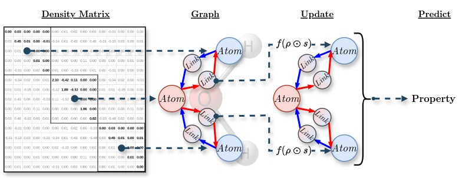
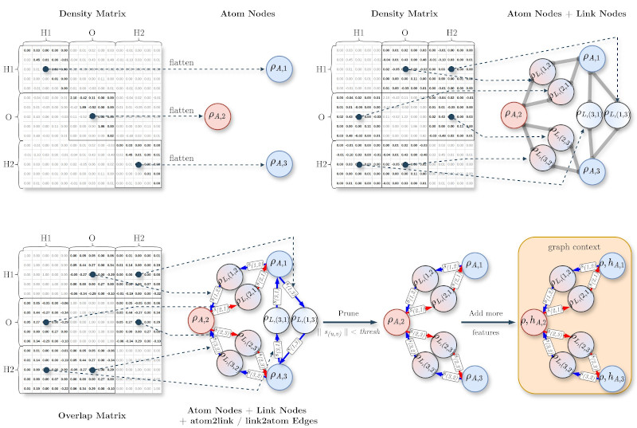

# RhNet2
This repository contains code for 
"[Neural Mulliken Analysis: Molecular Graphs from Density Matrices for QSPR on Raw Quantum-Chemical Data](https://doi.org/10.1021/acs.jctc.5c00425)"
paper (also available as a [preprint](https://doi.org/10.26434/chemrxiv-2024-k2k3l-v3) with fewer tests).



## Contents

- [Overview](#overview)
- [Repo structure](#repo-structure)
- [Input Data](#input-data)
   * [Quantum Chemical Data](#quantum-chemical-data)
   * [Graph Data](#graph-data)
   * [Tabular Data](#tabular-data)
- [Model Fit](#model-fit)
- [Inference](#inference)

## Overview
Here, raw quantum-chemical data in molecular graph form is used as input
for graph neural networks.
Molecular graphs are derived from 1-electron density matrix 
and basis set overlap matrix.

## Repo structure
🚧 🛠️ 🚧

## Input Data

The three main data types the model works with are:
- Electron structure information from 
[quantum-chemical calculations](#quantum-chemical-data) (training data 
preprocessing and inference)
- [Molecular graphs](#graph-data) derived from electron structure 
(for training only)
- [Tabular data](#tabular-data) e.g. containing target values, scalings etc. 
(for training data preprocessing only)

### Quantum Chemical Data

Quantum chemical data are extracted from the results of quantum chemical 
calculations performed using 
[the ORCA quantum chemistry program package](https://orcaforum.kofo.mpg.de/app.php/portal).
The computational workflow is described in detail in the corresponding
[paper](https://doi.org/10.1021/acs.jctc.5c00425) and 
[preprint](https://doi.org/10.26434/chemrxiv-2024-k2k3l-v3).

To automatically generate ORCA inputs and perform quantum-chemical calculations 
in large batches, the repository includes the `do_eldens.py` script, which can 
be invoked as follows:
```shell
python3 do_eldens.py --data_csv data/train_data.csv --conf_dir data/train_geoms --rot_aug 50 --work_dir data/temp --orca_path $orcadir --pal 10 --dft_inp_path qchem/orca_inputs/pbe_def2svp_orca29 --dmt_inp_path qchem/orca_inputs/noiter_moread --basis_path qchem/basis_sets/ANOR0_Ar 
```

`--data_csv data/train_data.csv` The path to a `.csv` file specifying a list of
compounds to be calculated in the following format:
```plaintext
"isomer_id","nconf"
"153-61-7",10
"153-61-7_reflect",11
...
```
In this example calculation on 10 conformers of *Cephalothin* (CASRN 153-61-7)
and on 11 conformers of its mirrored isomer is requested (corresponding 
conformers geometries should be already available)

`--conf_dir data/train_geoms` The path to a folder containing geometries in 
`.xyz` format. The filenames are expected to be `<isomer_id>_<conf_id>.xyz` 
e.g. `153-61-7_1.xyz`.

`--rot_aug 50` The number of randomly rotated electron density distributions of
a particular conformer to be calculated. 

`--work_dir data/temp` The path to a folder containing the results of 
quantum-chemical calculations (zipped ORCA logs).

`--orca_path $orcadir` The path to the ORCA executables.

`--pal 10` The number of simultaneously performed ORCA calculations 

`--dft_inp_path qchem/orca_inputs/pbe_def2svp_orca29` The path to a regular
ORCA calculation input template.

`--dmt_inp_path qchem/orca_inputs/noiter_moread` The path to an input template
performing MOs projection using ORCA.

`--basis_path qchem/basis_sets/ANOR0_Ar` The path to a template with the basis 
set in which electron densities are to be expanded for model fitting.

**Notes:**
* `do_eldens.py` doesn't perform conformer search or geometry optimization,
these should be somehow done in advance. 
* Used here for electron density expansion, ANO-R0 basis set is not probably 
the best choice in terms of both accuracy and computational efficiency.

### Graph Data


Density and overlap matrices are extracted from quantum-chemical calculations 
logs and are split into graph nodes and edges embeddings. 
E.g. diagonal density matrix blocks are used as atomic nodes embeddings, 
off-diagonal blocks provide embeddings for “link” nodes corresponding 
to atomic pairs. 
The overlap matrix is used in edge embeddings. 
Overlaps are used:
* to encode structural information 
* as weights for pooling operations
* provide access to the actual electronic charges (due to the element-wise 
multiplication performed while pooling)

For further details see the corresponding
[paper](https://doi.org/10.1021/acs.jctc.5c00425) and 
[preprint](https://doi.org/10.26434/chemrxiv-2024-k2k3l-v3).

For inference, only nodes embeddings, edges embeddings, adjacency, etc. 
matrices in TF tensor format are needed, see [Inference](#inference) section.

For training, these should be further converted into TF-GNN GraphTensor format.
To automatically convert ORCA outputs into GraphTensors and save them 
in `.tfrecord` format in large batches, the repository includes the 
`do_tfrecords.py` script, which can be invoked as follows:
```shell
python3 do_tfrecords.py --save_path data/tfrecords --record_name train --schema_path schema_template --data_csv data/train_data.csv --orca_outs data/temp --rot_aug 50 --overlap_thresh 0.035 --multi_target --scalings_csv scalings.csv --gepol_path <gepol_path>    
```

`--save_path data/tfrecords` The general path where the tfrecords will be stored

`--record_name train` Data set name i.e. the actual path to the saved data is 
`<save_path>/<record_name>`

`--schema_path schema_template` The path to a graph schema template  

`--data_csv data/train_data.csv` The path to a `.csv` file specifying a list of
compounds to be included in the dataset in the following format: 
```plaintext
"cas","isomer_id","target","nconf"
"153-61-7","153-61-7",2.83,10
"153-61-7","153-61-7_reflect",2.83,11
"90-15-3","90-15-3",4.02,2
```
In this example two records will be saved containing graphs corresponding to
all (rotated) conformers and isomers of *Cephalothin* (CASRN 153-61-7) and to
all (rotated) conformers of *1-Naphthol* (CASRN 90-15-3) as `153-61-7.tfrecord` and 
`90-15-3.tfrecord` (records are grouped by `cas` column). `target` column
contains the true values to be included in the saved records.
 
`--orca_outs data/temp` The path to the results of quantum-chemical calculations.
The filename format is expected to be `<isomer_id>_<conf_id>_<rot_id>.out` or 
`<isomer_id>_<conf_id>_<rot_id>.zip` 
(containing `<isomer_id>_<conf_id>_<rot_id>.out`)

`--rot_aug 50` The number of available randomly rotated electron density 
distributions of a particular conformer.

`--overlap_thresh 0.035` Graph edges pruning threshold

`--multi_target` Whether to include in the records multiple targets if a model
is intended to predict several properties. If invoked, a list of targets will
be read from the schema template. The `<data_csv>` file 
should have the following format:
```plaintext
"cas","isomer_id","target","melt","logk","nconf"
"153-61-7","153-61-7",2.83,1.600,-0.410,10
"153-61-7","153-61-7_reflect",2.83,1.600,-0.410,11
"90-15-3","90-15-3",4.02,0.957,2.850,2
```
Here, `melt` and `logk` columns contain the true values for additional targets.

`--scalings_csv scalings.csv` Path to a `.csv` file specifying scaling factors 
to be applied to the target values of the following format:
```plaintext
"target","divisor"
"melt",100.0
"logk",1.0
"dipole",10.0
"vol",100.0
"surf",100.0
```

`--gepol_path <gepol_path>` Path to the 
[GEPOL93](https://doi.org/10.1002/jcc.540151009) executables for molecular 
volume and surface calculation. 
Molecular volume and surface may be used as additional targets for 
regularization purposes.
  
**Notes:**
* `do_tfrecords.py` doesn't perform quantum-chemical calculations or rotational
augmentation, these should be done e.g. using `do_eldens.py` script in advance.
* Aside from molecular volume and surface, the use of the electric dipole 
moment amplitude as an additional target is implemented. 
The necessary values will be automatically extracted from the calculation 
results if the schema template contains `dipole` key.    

### Tabular Data
🚧 🛠️ 🚧

## Model Fit
🚧 🛠️ 🚧

## Inference
For inference, graphs and TF-GNN module are not needed. 
The results of quantum chemical calculations can be directly parsed into 
suitable for inference TF tensors. 
Inference examples along with trained models are provided in separate repositories:
* The Second Solubility Challenge (SC-2, 
[link](https://doi.org/10.1021/acs.jcim.9b00345),
[link](https://doi.org/10.1021/acs.jcim.0c00701)) solution 
[on GitHub](https://github.com/Shorku/SolubilityChallenge2019/blob/main/rhnet2.ipynb)
(a lighter model trained on a slightly bigger dataset, **better suited to play with**).
* The First Solubility Challenge (SC-1,
[link](https://doi.org/10.1021/ci800058v),
[link](https://doi.org/10.1021/ci800436c)) solution
[on GitHub](https://github.com/Shorku/SolubilityChallenge2008/blob/main/rhnet2.ipynb) 
and [on Hugging Face](https://huggingface.co/Shorku/RhNet2SC1/blob/main/RhNet2SC1.ipynb)
(ensemble of heavier models trained on a tiny dataset, **probably to heavy to play with**).
